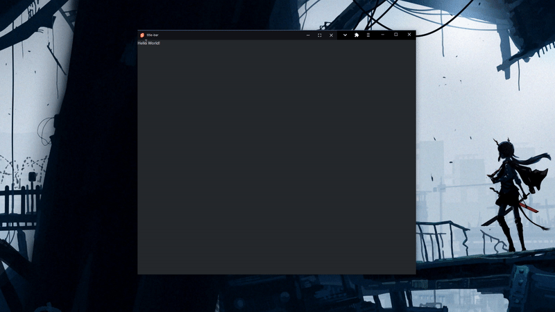

<h1 align="center">
	Title Bar
</h1>
<p align="center">
  <br>
</p>
Universal title bar module for PWA's or Electron apps. Allows for custom buttons.

For PWA's your app needs to have the `window-controls-overlay` enabled and the browser needs to [support the feature](https://caniuse.com/mdn-api_windowcontrolsoverlay):
```json
// site.webmanifest
{
  // ...
  "display_override": ["window-controls-overlay"],
  // ...
}
```
The titlebar title is inherited from the document's title, and the image is the first favicon entry in the website. They can be overwritten using their respective props.

For electron you need to the enable the custom controls using the `controls` prop, handle the maximize and minimize events yourself, and create a frameless window:
```js
new BrowserWindow({
  // ...
  frame: false,
  autoHideMenuBar: true,
  /// ...
})
```
## Functions:
```jsx
import titlebar from 'universal-title-bar'
import snap from 'snap-layout'

<titlebar controls={true} autohide={true} hidden={false} title='My App' image='./image.png' on:close={() => { window.close() }} on:maximize={() => { handleMax() }} on:minimize={() => { handleMin() }}>
  <snap-layout size='env(titlebar-area-height, 32px)' />
</titlebar>
```

Or use as a web component outside Svelte:
```html
<script src="https://cdn.jsdelivr.net/npm/universal-title-bar@latest/dist/universal-title-bar.js"></script>
<body>
  <universal-title-bar controls="true"></universal-title-bar>
</body>
```